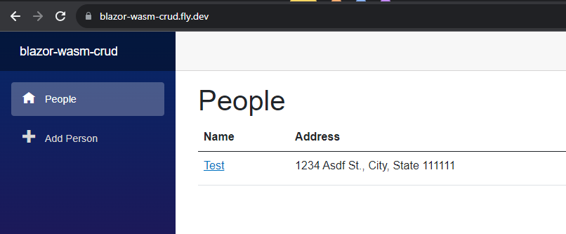
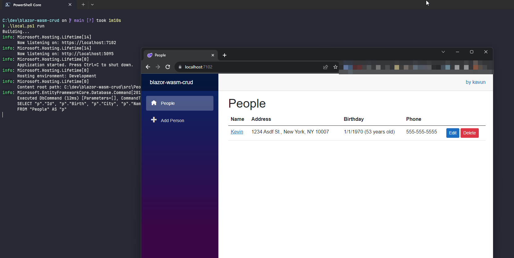
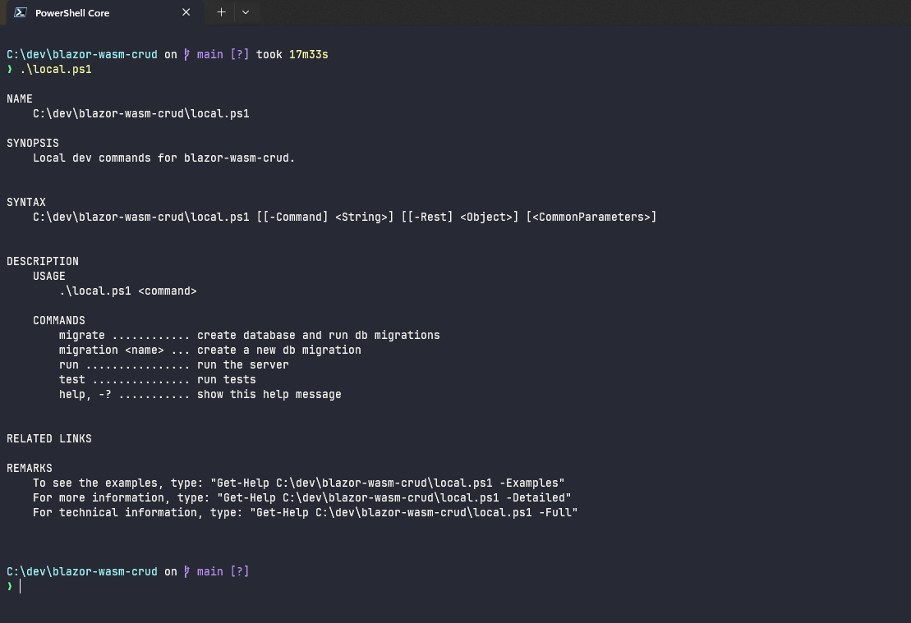

# blazor-wasm-crud

[](https://github.com/kavun/blazor-wasm-crud/actions/workflows/dotnet.yml)
[](https://github.com/kavun/blazor-wasm-crud/actions/workflows/fly.yml)

This is a sample Blazor application that allows CRUD of People. This showcases the following stack:

- [Blazor WebAssembly](https://learn.microsoft.com/en-us/aspnet/core/blazor/hosting-models?view=aspnetcore-7.0#blazor-webassembly)
- [ASP.NET Core Web API](https://learn.microsoft.com/en-us/aspnet/core/web-api/?view=aspnetcore-7.0)
- [mcintyre321/OneOf](https://github.com/mcintyre321/OneOf) and [svan-jansson/OneOf.Monads](https://github.com/svan-jansson/OneOf.Monads)
- [Entity Framework Core](https://learn.microsoft.com/en-us/ef/core/)
- [SQLite](https://www.sqlite.org/index.html)
- [xUnit](https://xunit.net/)
- [bUnit](https://bunit.dev/)
- [WebApplicationFactory integration tests](https://learn.microsoft.com/en-us/aspnet/core/test/integration-tests?view=aspnetcore-7.0) with [SQLite in-memory database](https://sqlite.org/inmemorydb.html)
- [.\local.ps1](https://github.com/kavun/ps-cli)

See the running application: blazor-wasm-crud dot fly dot dev


## Develop

### Prerequisites
- Install dotnet 7 SDK: https://dotnet.microsoft.com/en-us/download/dotnet/7.0
- Install `dotnet ef` (>= v7.0.13)
```powershell
dotnet tool install --global dotnet-ef --version 7.0.13
```

### Run

Create and migrate the SQLite database, and start the server.

```powershell
.\local.ps1 run
```
If this is the first time running the application, this will create `.\src\People.BlazorWasmServer\people.db`.

View the running application at https://localhost:7102



### Test

Run the tests

```powershell
.\local.ps1 test
```

### Migrate database

```powershell
.\local.ps1 migrate
```
### Add new migrations
If you make changes to the database models, you'll need to create a new migration. This will create a new migration file in `.\src\People.Infrastructure\Migrations`.

```powershell
.\local.ps1 migration MyNewMigration
```

## Explainer

### Blazor WebAssembly

#### Comparison to JavaScript
This application is built using the WASM hosting model with the idea that the client should make HTTP calls to a REST API. I'm not sure that this model of using a WASM version of .NET's `HttpClient` is better or worse than a JavaScript based client that uses `fetch`, but it certainly allows sharing request/response models between the client and server.

#### Event Handling
One hiccup I ran into is that it's not trivial to pass arguments to event handlers. For example, when clicking the Delete button to delete a Person, I want to pass the Person's ID to the event handler. I ended up using a lambda expression:

```html
<button @onclick="@((e) => DeletePerson(person.Id))">Delete</button>
```

This works, but comes with the [warning](https://learn.microsoft.com/en-us/aspnet/core/blazor/components/event-handling?view=aspnetcore-7.0#lambda-expressions):

> Creating a large number of event delegates in a loop may cause poor rendering performance. For more information, see [ASP.NET Core Blazor performance best practices](https://learn.microsoft.com/en-us/aspnet/core/blazor/performance?view=aspnetcore-7.0#avoid-recreating-delegates-for-many-repeated-elements-or-components).

#### Error Handling

I kept the global error handling UI, but would want to improve this experience. This is especially noticeable when we check API response status codes with

```csharp
response.EnsureSuccessStatusCode();
```
... but don't have a way currently to display a useful message to the user without introducing a `try/catch` block.

### ASP.NET Core Web API

The main thing to note here is that the controller is doing 2 things:
- call the `IPeopleService`
- map response from service to an appropriate HTTP status code

The basic pattern is:

```csharp
[HttpPost]
public IResult HandleSomePost([FromBody] SomeRequest request)
{
    var result = _peopleService.DoSomething(request);
    return result.Match(
        (error) => Results.BadRequest(new SomeResponse(error.Value))),
        (success) => Results.Ok(new SomeResponse(success.Value)));
}
```

The response for 400 and 200 being of the same shape (`SomeResponse`) simplifies and adds flexibility to the client that calls the API, since it can always deserialize the response into the same type, and then can either (1) check for `.error === true` to determine if the response is an error or not, or (2) check the HTTP status code. The shape of this object returned looks like:

```json
{
    "error": false,
    "errors": [],
    "person": {
        "id": "00000000-0000-0000-0000-000000000000",
        "firstName": "John",
        "lastName": "Doe"
    }
}
```

This allows for extension of the response in the future if necessary. For example, if we wanted to add a `warnings` array, we could do so without it being a breaking change for the client.

```json
{
    "error": false,
    "errors": [],
    "warnings": [],
    "person": {
        "id": "00000000-0000-0000-0000-000000000000",
        "firstName": "John",
        "lastName": "Doe"
    }
}
```

### OneOf and OneOf.Monads

The `IPeopleService` and also the `Person` respond with `OneOf` types. For example:

```csharp
interface IPeopleService {
    Result<PersonNotFound, Person> FindPerson(Guid id);
}
```

and

```csharp
class Person {
    private Person() { }

    public static Result<PersonInvalid, Person> Create(PersonRequest request) {
        if (/* request is invalid */) {
            return new PersonInvalid();
        }

        return new Person() {
            // ...
        };
    }
}

```

This makes the domain and application explicit about what can go wrong. This forces the callers (application and controller) to handle all the return scenarios. It also prevents throwing exceptions for validation, which I see very often:

```csharp
class Person {
    public Person(string name) {
        if (string.IsNullOrWhiteSpace(name)) {
            // bad!
            throw new PersonInvalidException();
        }

        Name = name;
    }
}
```
Exceptions should be exceptional. If we expect that a `Person` can be invalid, then we should inform the caller as such. This does require you to not use the `new` keyword, but instead use a static factory method, but it's a tradeoff that I think is worth it.

OneOf has some basic return types, but I prefer creating my own return types with C# records, since they're usually only one liners and are more expressive than OneOf's `Success`/`NotFound`/etc.

```csharp
public record PersonNotFound(Guid Id) {
    public string Message => $"Person with ID {Id} not found";
}
public record PersonBirthCannotBeInFuture();
public record PersonInvalid(FieldErrors Errors);
```

#### Why OneOf.Monads?

Without OneOf.Monads, the `PeopleService` would need to check `.IsT1` and use `.AsT0` and `.AsT1`.

```csharp
public OneOf<PersonAddError, PersonResponse> AddPerson(PersonAddEditRequest request)
{
    var result = Person.Add(_clock, request);
    if (result.IsT0)
    {
        return new PersonAddError(result.AsT0);
    }

    var person = result.AsT1;
    _repository.InsertPerson(person);
    return person.ToPersonResponse();
}
```

With OneOf.Monads, we get a `Result<Error, Success>` type that wraps `.IsT0` with a more expressive `.IsError()`:

```csharp
public Result<PersonAddError, PersonResponse> AddPerson(PersonAddEditRequest request)
{
    var result = Person.Add(_clock, request);
    if (result.IsError())
    {
        return new PersonAddError(result.ErrorValue());
    }

    var person = result.SuccessValue();
    _repository.InsertPerson(person);
    return person.ToPersonResponse();
}
```

### Entity Framework Core

There's a lot of discussion around using a `DbContext` directly as a repository, but this makes unit tests more difficult since it requires you to create mock/fake `DbSet`. For this application I preferred to use my own repository which allows me to easily create a fake repository for unit tests.

```csharp
interface IPeopleRepository {
    void Insert(Person person);
    // ...
}
class PeopleEfRepository : IPeopleRepository {
    public PeopleEfRepository(PeopleDbContext db) {
        _db = db;
    }
    public void Insert(Person person) {
        _db.People.Add(person);
        _db.SaveChanges();
    }
}
class FakePeopleRepository : IPeopleRepository {
    public List<Person> People { get; } = new();
    public void Insert(Person person) {
        People.Add(person);
    }
}
```

### SQLite

SQLite lets us quickly get up and running without having to install a database server. Also, the in-memory version is great for integration tests, since it allows us to still use the "real" database provider, but without having to worry about cleaning up the database after each test. Often integration tests will switch to a in memory EF Core database, which requires you to not use any database specific features and changes the backing data storage mechanism, so when you run integration tests in this way, you're not really testing the same data store. If using a database like MySQL or Postgres, I would create a docker compose application to host a test database.

### xUnit

I have wired up logging for the integration tests with `ITestOutputHelper` with [Meziantou.Extensions.Logging.Xunit](https://www.meziantou.net/how-to-get-asp-net-core-logs-in-the-output-of-xunit-tests.htm#how-to-use-the-logge). This allows seeing the logs from the server when running the `WebApplicationFactory` integration tests.

### bUnit

The recommended practice here is to write your xUnit `[Fact]`s in `.razor` files. This feels odd at first, but allows rich editor support of the Blazor components.

### local.ps1

Running the `dotnet` commands for migrations and running the application can become tiring to copy/paste, so for most projects I create a "makefile" style PowerShell script to run common local dev tasks. I've blogged about this in detail here: https://kevinareed.com/2021/04/14/creating-a-command-based-cli-in-powershell/.


